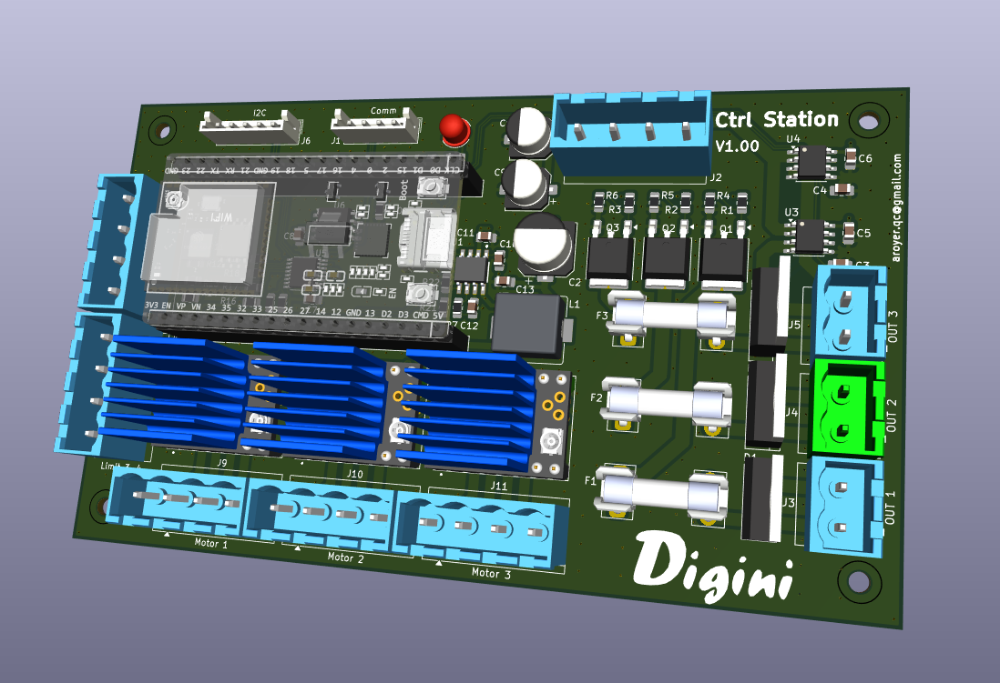

# SolarStation

ESP32-based solar station firmware for two-axis panel positioning, output scheduling, diagnostics, and network control. The firmware is designed for the Solar Station control PCB; its third stepper channel is currently unused by this project.

## Current Status

The firmware is in an active integration phase.

Implemented and working in firmware:

- FastAccelStepper integration with the PCB's 3 available stepper channels.
- Axis control on real steppers:
	- Azimuth controller uses Stepper1.
	- Elevation controller uses Stepper2.
	- Stepper3 is currently unused and available for future or other control applications.
- Configurable axis parameters (persisted):
	- Min/max angle limits.
	- Steps-per-degree ratio.
	- Step speed and acceleration.
- Portal dashboard + configuration UI (`/` and `/portal`) with sections for:
	- Solar tracking settings.
	- Axis settings.
	- Wi-Fi and NTP.
	- Output manual/auto control and schedules.
	- Hardware diagnostics (limit switches, driver DIAG, currents, sunrise/sunset).
- Output scheduler (3 outputs) with:
	- Fixed time or sunrise/sunset windows.
	- Duty cycle control.
	- AUTO/MANUAL mode per output.
- Wi-Fi behavior:
	- STA when configured.
	- AP fallback/setup mode when STA is not configured or fails.
- Sunset return preposition behavior:
	- Always active.
	- Executes once per target day.
	- Uses a fixed delay after local sunset before prepositioning to next sunrise target.
- Diagnostics override workflow:
	- Dedicated page (`/diag` and `/portal/diag`) to force azimuth/elevation for testing.
	- Canceling test mode returns panel to current calculated solar position.

## Testing Without Optional Hardware

The firmware includes compile-time switches for testing on an ESP32 without all of the connected hardware. In `Solar-Station.ino`, set any unavailable hardware feature to `0` before compiling:

```cpp
#define USE_BH1750_SENSOR 0  // Disable the BH1750 light sensor
#define USE_IO_EXPANDER   0  // Disable the PCA9538 I2C I/O expander
#define USE_M95P32        0  // Disable the M95P32 external SPI EEPROM
```

Available hardware switches:

- `USE_BH1750_SENSOR`: BH1750 light sensor support; default is `1`.
- `USE_IO_EXPANDER`: PCA9538 I2C I/O expander support; default is `1`.
- `USE_M95P32`: M95P32 external SPI EEPROM support; default is `1`.

Disable only the hardware that is not connected. With a feature disabled, its driver is excluded from the build and the related initialization and access code is skipped. The ESP32, firmware logic, web interface, and other enabled features can then be tested independently.

## Control PCB

The firmware is designed for the ESP32-based Solar Station control PCB shown below. The PCB can also be reused for other automation and control projects because it provides:



- Three stepper motor controller channels; this project uses two for azimuth and elevation, while the third is currently unused.
- Inputs for switches such as limit switches and other digital status signals.
- Three MOSFET-controlled outputs that use the connected 12 V to 36 V power supply.
- One I2C port.
- One communication port.
- 3.3 V logic levels for the I2C and communication ports.

Check the electrical requirements of each connected motor, switch, and load before use. The MOSFET outputs switch the board's power-supply voltage, while the I2C and communication interfaces use 3.3 V logic.

## Hardware Notes (Current Wiring Assumptions)

- MCU: ESP32.
- Stepper drivers: TMC2209 (3 channels; two used by this project, one available).
- I/O expander: PCA9538 (I2C) for shared microstep pins, status LED, and limit switch inputs.
- External SPI EEPROM module support included (`M95PxxModule`).

## Main Runtime Modules

- `Solar-Station.ino`: orchestration, hardware init, scheduler, diagnostics helpers, sunset return, test override state.
- `ConfigModule.h` / `ConfigModule.ino`: persisted configuration storage and defaults.
- `AzimuthController.*`: azimuth axis control on FastAccelStepper.
- `ElevationController.*`: elevation axis control on FastAccelStepper.
- `WebServerModule.*`: synchronous web server routes and HTML placeholder binding.
- `WifiModule.*`: STA/AP behavior and reconnect strategy.
- `portal/index.html`: AP/setup portal page.
- `portal/diag.html`: diagnostics override page.
- `console/index.html`: full network console page.

Web UI deployment model:

- Local UI files are served from device filesystem (LittleFS/SPIFFS data partition).
- Use the `data` folder content and upload it with `tools/upload_spiffs.ps1` after firmware upload.
- Filesystem layout:
	- `data/portal/*` for AP/setup pages.
	- `data/console/*` for full network console pages.

## Web Endpoints (Current)

Main pages:

- `GET /` main dashboard/configuration page.
- `GET /portal` AP/setup portal page.
- `GET /diag` diagnostics test page.
- `GET /portal/diag` diagnostics test page.
- `GET /console` full network console page.
- `GET /diag/status` plain-text status snapshot for diagnostics page refresh.

Tracking diagnostics actions:

- `POST /setTrackingOverride` (form fields: `azimuth`, `elevation`).
- `POST /cancelTrackingOverride`.

Configuration actions (examples):

- `POST /saveSolarTrackingConfig`
- `POST /saveAzimuthConfig`
- `POST /saveElevationConfig`
- `POST /saveNTPConfig`
- `POST /saveWiFiConfig`
- `POST /saveScheduleConfig`

## Configuration Persistence

Configuration is stored with ESP32 Preferences.

- Main configuration uses a raw blob (`ConfigData_t`).
- Output AUTO/MANUAL flags are stored in separate keys (`out_auto_0..2`).

Important:

- Any structural change to `ConfigData_t` size causes existing blob data to be considered incompatible and defaults are restored on next boot.

## Build Portability (Another PC)

This project now includes the async network libraries in the project `libraries` folder, so the same code and patches follow the project:

- `libraries/ESPAsyncWebServer` (v3.1.0, with local compatibility patches)
- `libraries/AsyncTCP` (v1.1.4)
- `libraries/ESPAsyncTCP`

To build on another computer:

1. Install Arduino IDE 2.x.
2. Install `esp32` board platform in Boards Manager.
3. Open `Solar-Station.ino` from this project folder (do not copy only the `.ino` file).
4. Compile directly; do not install another conflicting `ESPAsyncWebServer` manually unless you intentionally want to replace the bundled one.

Recommended:

- If you already have other async web libraries globally installed in your Arduino libraries folder, keep versions aligned with this project to avoid API/link mismatches.

## Known Limitations / Work In Progress

- Legacy configuration compatibility paths and placeholder-based HTML binding remain in the codebase.
- Arduino IntelliSense can report false compile errors in editor context even when firmware logic is valid.
- Full production solar tracking loop policy (beyond targeted move and preposition behavior) may still need refinement for final deployment scenarios.

## Quick Validation Checklist

- Open `/` and verify dashboard values update.
- Confirm Wi-Fi mode (STA or AP fallback) is shown correctly.
- In configuration tabs, set axis limits/ratio/speed/acceleration and save.
- Use `/diag`:
	- Apply manual override.
	- Cancel test and verify return to current calculated position.
- Verify sunset return preposition occurs after sunset + fixed delay.

## License

This project is released under the [MIT License](https://opensource.org/license/mit/).

Project files contain their own headers where applicable.
